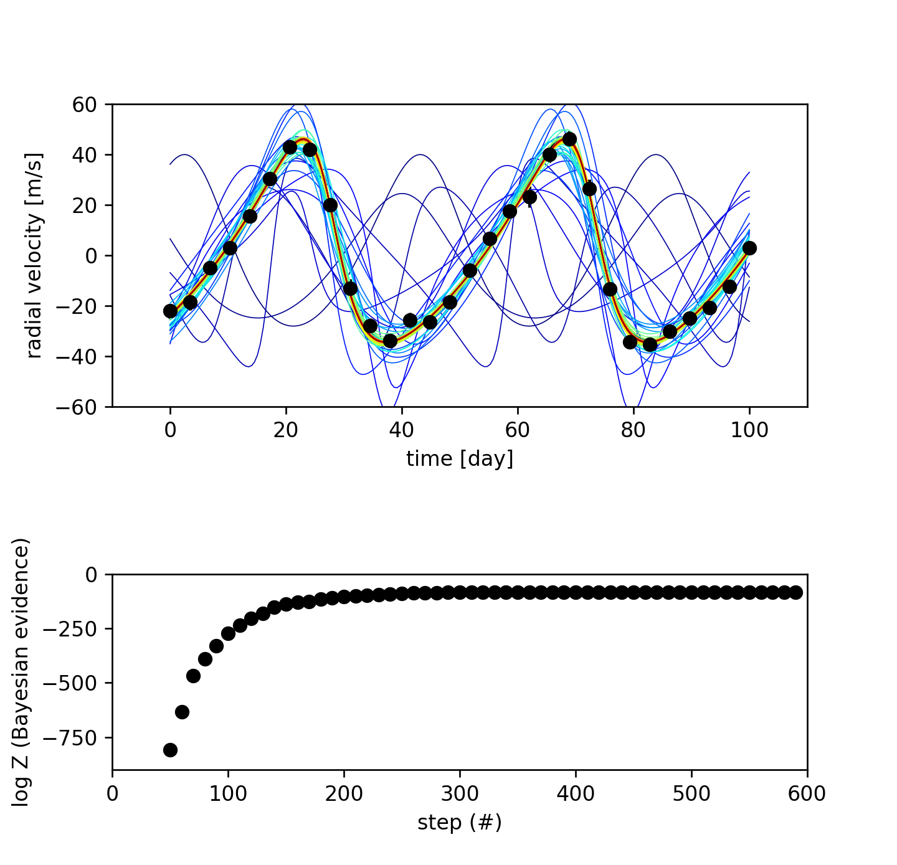
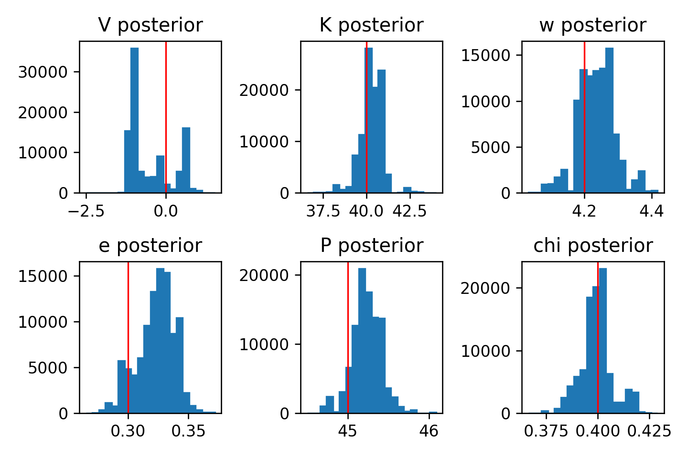

# nestedsampling-python
Nested Sampling Parameter Fitting and Model Selection

## Create Your Own Nested Sampling Algorithm for Bayesian Parameter Fitting and Model Selection (With Python)

### Philip Mocz (2023) [@PMocz](https://twitter.com/PMocz)

### [📝 Read the Algorithm Write-up on Medium](https://levelup.gitconnected.com/create-your-own-nested-sampling-algorithm-for-bayesian-parameter-fitting-and-model-selection-with-3cfdeae4afd)

Apply the Nested Sampling Monte Carlo algorithm to fit exoplanet radial 
velocity data and estimate the posterior distribution of the model 
parameters. This technique is more advanced and robust than simple 
Metropolis-Hastings [MCMC sampling](https://github.com/pmocz/mcmc-python)


```
python nestedsampling.py
```




